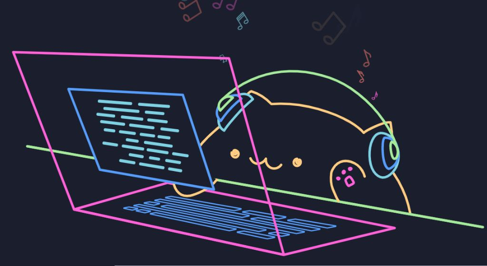

<p align="center">
  
</p>

<h1 align="center">Shashidhar Nagunuri</h1>

<h3 align="center">
Full-Stack Developer • Java Developer • GenAI Explorer
</h3>

<p align="center">
Building scalable applications, real-time systems, and AI-powered solutions.
</p>

<p align="center">
  <a href="https://github.com/shashidhar078">
    
  </a>
  <a href="https://linkedin.com/in/shashidhar-nagunuri">
    
  </a>
</p>

---

# About Me

```yaml
name: Shashidhar Nagunuri

role: Full-Stack Developer

specialization:
  - Backend Engineering
  - Real-Time Systems
  - Artificial Intelligence

currently_exploring:
  - LangChain
  - Agentic AI
  - Distributed Systems
  - Advanced System Design
```

I enjoy designing systems that are efficient, scalable, and built to solve real-world problems.

My interests include:

- Full-stack development
- Real-time applications
- Artificial intelligence
- Cloud infrastructure
- Distributed systems
- Backend engineering

---

# Tech Stack

### Languages

<p>

</p>

---

### Frontend

<p>

</p>

---

### Backend

<p>

</p>

- REST APIs
- Authentication
- Authorization
- WebSockets
- Real-time communication

---

### Databases

<p>

</p>

---

### Artificial Intelligence

- LangChain
- Retrieval-Augmented Generation (RAG)
- Agentic AI
- Prompt Engineering

---

### Data Engineering

- Apache Kafka
- Apache Spark

---

### DevOps & Cloud

<p>

</p>

- Docker
- Kubernetes
- CI/CD Pipelines
- GitHub Actions
- Nginx
- AWS

---

# Current Focus

- Building scalable backend systems

- Developing AI-powered applications

- Exploring distributed systems

- Strengthening system design skills

- Solving data structures and algorithms problems

---

## 📈 Activity

<p align="center">
  
</p>

---

# Connect With Me

<p align="center">

<a href="https://linkedin.com/in/shashidhar-nagunuri">

</a>

<a href="mailto:nagunurishashidhar@gmail.com">

</a>

</p>


<p align="center">
Building scalable systems, one project at a time.
</p>
